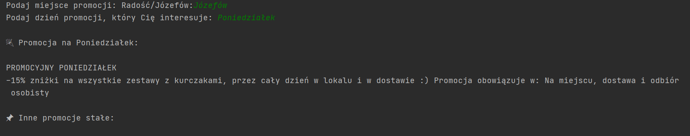
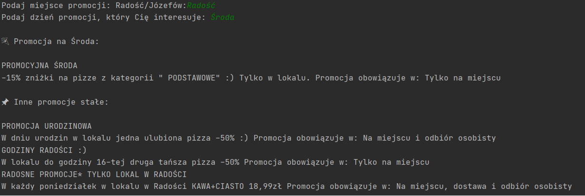
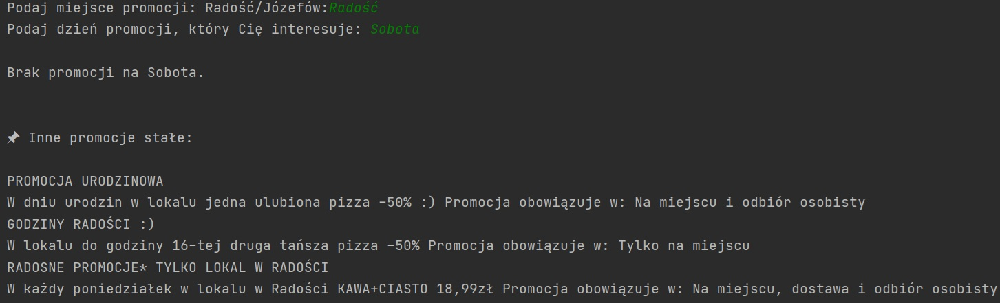

# PizzaZRadosci-Promotions
Basic WebScrapping using selenium and python for finding actual promotions of local restaurant
# 🍕 Pizza Promotion Scraper
This script allows you to check daily and constant pizza promotions from **Pizza z Radości** based on the selected location and day of the week.
## ✅ Requirements
Before running the script, make sure you have the following:
1. **EdgeDriver** properly configured on your system (and added to PATH).
2. Required Python libraries installed.
3. Python 3.x installed.

## 📦 Installation

Install the required libraries by running:

```bash
pip install selenium
```
</br>
🖼️ Screenshots from app

### 📅 Monday – Józefów


### 📅 Wednesday – Radość


### 📅 Saturday – Radość

Notes: <b>
The script uses a headless Edge browser, so it runs in the background.
</br>
Zoom is reduced to 10% to ensure all promotion content loads correctly. 
</br>
There is no constant promotions in "Józefów".
</br>
Days of the week/information are in polish</b>
